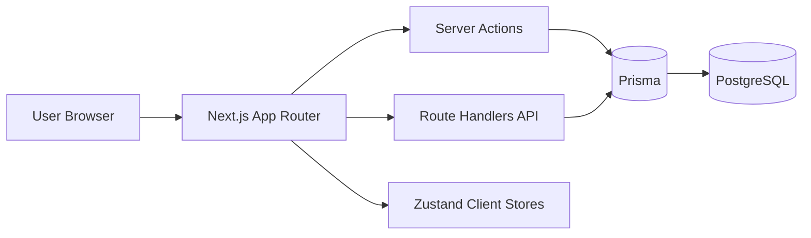
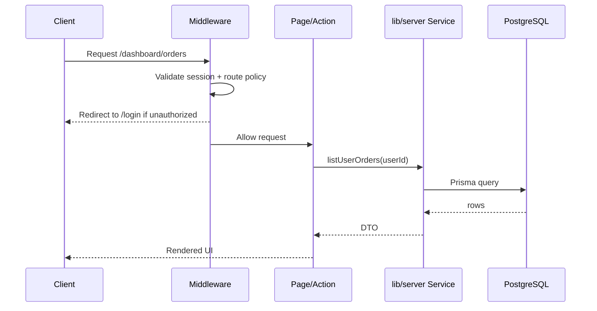
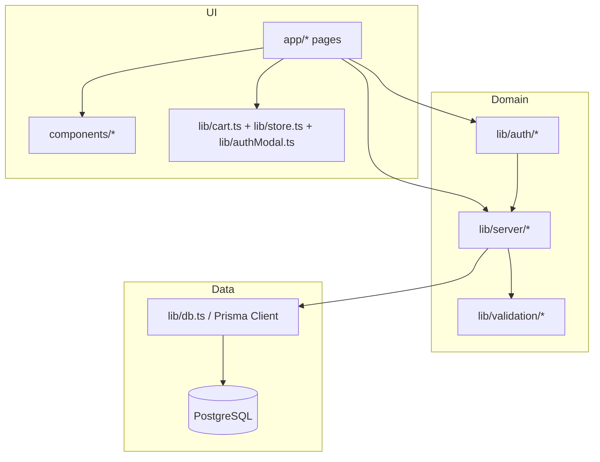
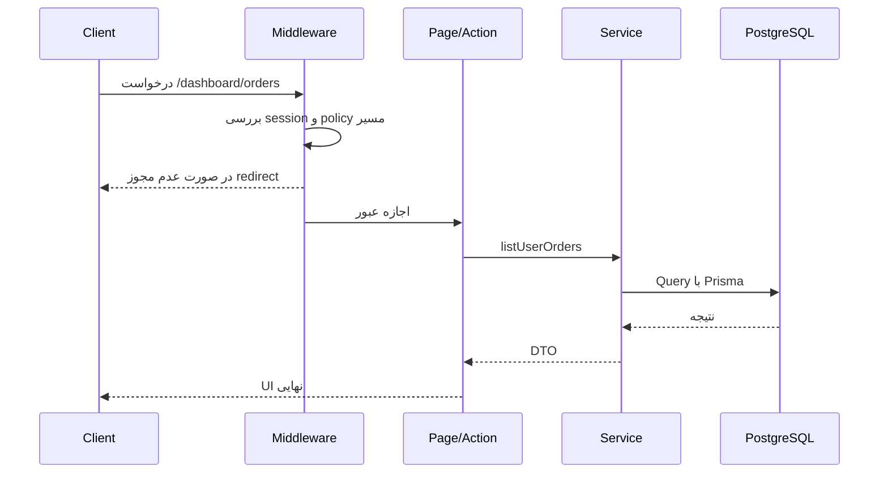
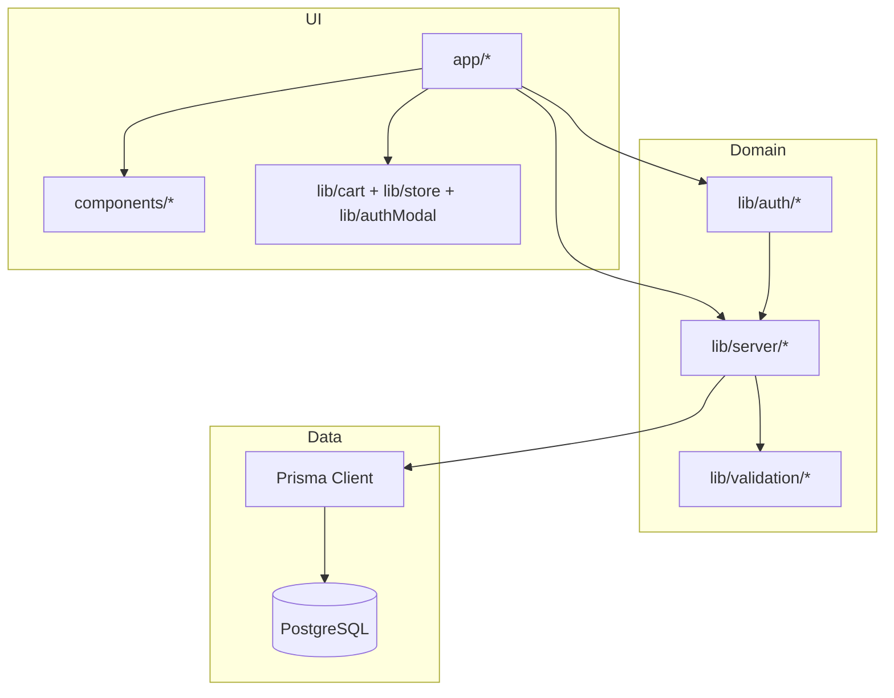

# 02. Architecture

## English | فارسی

English

## Beginner Mode

### System Architecture (Bird's-eye)

### Frontend Architecture

- RSC-first page architecture using App Router
- Client components for interactions (cart drawer, modals, admin legacy pages)
- Global providers include auth session and auth modal mounting
- Styling system centered on Tailwind utility + shared component primitives

### Backend Architecture

- Server actions for mutation-heavy flows (checkout, dashboard updates, admin CRUD)
- API route handlers for externally callable auth/report endpoints
- Business logic centralized in `lib/server/*`
- Input contracts enforced by Zod schemas in `lib/validation/*`

### Database Architecture

- Prisma schema models users, orders, recipes, ratings, discounts, combos, referrals
- Referential integrity through FK relations and cascade/set-null strategies
- Unique constraints enforce domain invariants (e.g., one rating per user per sandwich)

### Communication Flow

### State Management

| State Type                 | Location            | Notes                                            |
| -------------------------- | ------------------- | ------------------------------------------------ |
| Cart state                 | `lib/cart.ts`       | Client-side persisted; server recomputes pricing |
| Auth modal UI state        | `lib/authModal.ts`  | Global UX state, not auth authority              |
| Legacy admin/catalog state | `lib/store.ts`      | Used by some admin and review flows              |
| Persistent business state  | PostgreSQL + Prisma | Source of truth for orders/auth/discounts/etc.   |

### Routing Model

- Public routes: home, menu, about/contact/login, auth APIs
- Protected routes: dashboard, checkout, community (logged-in)
- Admin routes: `/admin/*`, role-gated in middleware + server-side checks

## Expert Mode

### Component/Module Dependency Graph

### Architectural Tradeoffs

- Pro: Fast delivery by preserving some legacy client-state admin flows
- Con: Dual data model complexity (legacy Zustand + Prisma)
- Pro: Server action-centric mutation path keeps domain logic close to route ownership
- Con: Mixed action/API patterns require strong contract docs to avoid drift

### Extension Points

- Add feature repositories in `lib/server` with dedicated validation schema files
- Expose mutation as server actions when tightly coupled to UI route
- Expose route handlers when external consumption, file downloads, or callbacks are needed
- Use middleware only for coarse access gating, never as sole authorization layer

### Architecture Decision Snapshot

- Auth.js configured split-brain intentionally:
  - edge-safe config in `lib/auth/auth.config.ts`
  - node runtime provider logic in `lib/auth/index.ts`
- This avoids importing Node-only modules in edge middleware.

فارسی

## Beginner Mode

### معماری کلان سیستم

### معماری فرانت‌اند

- معماری App Router با اولویت Server Components
- کامپوننت کلاینتی برای تعاملات (سبد، مودال، صفحات Legacy ادمین)
- Provider سراسری برای session و auth modal
- استایل مبتنی بر Tailwind + primitiveهای مشترک

### معماری بک‌اند

- Server Action برای سناریوهای Mutation (checkout، dashboard، admin CRUD)
- Route Handler برای endpointهای عمومی مثل auth/report export
- منطق دامنه در `lib/server/*`
- اعتبارسنجی ورودی با Zod در `lib/validation/*`

### معماری دیتابیس

- Prisma مدل‌های کاربر، سفارش، recipe، امتیاز، تخفیف، کمبو، referral را مدیریت می‌کند
- یکپارچگی ارجاعی با FK و رفتار onDelete مناسب
- قیود یکتا برای قوانین دامنه (مثل یک امتیاز برای هر کاربر/ساندویچ)

### جریان ارتباطی

### مدیریت State

| نوع استیت                 | محل                 | توضیح                                  |
| ------------------------- | ------------------- | -------------------------------------- |
| سبد خرید                  | `lib/cart.ts`       | پایدار روی کلاینت؛ قیمت نهایی سمت سرور |
| وضعیت مودال احراز هویت    | `lib/authModal.ts`  | فقط UX، نه مرجع auth                   |
| state قدیمی ادمین/کاتالوگ | `lib/store.ts`      | بخشی از پنل هنوز استفاده می‌کند        |
| state اصلی دامنه          | PostgreSQL + Prisma | مرجع نهایی داده                        |

### مدل مسیریابی

- مسیر عمومی: صفحه اصلی، منو، درباره/تماس/ورود، auth API
- مسیر محافظت‌شده: dashboard، checkout، community
- مسیر ادمین: `/admin/*` با Role check در middleware و سرور

## Expert Mode

### گراف وابستگی ماژول‌ها

### Tradeoffهای معماری

- مزیت: سرعت توسعه با حفظ بخشی از Legacy admin
- هزینه: پیچیدگی به‌دلیل همزیستی Zustand و DB
- مزیت: نزدیکی منطق mutation به route از طریق server action
- هزینه: نیاز به مستندسازی دقیق قراردادهای action/API

### نقاط توسعه

- افزودن repository جدید در `lib/server`
- ساخت schema متناظر در `lib/validation`
- استفاده از server action برای mutationهای وابسته به UI
- استفاده از route handler برای مصرف خارجی/دانلود/کالبک

### تصمیم کلیدی

- تفکیک auth edge-safe و node-runtime برای جلوگیری از import ماژول‌های Node در middleware

