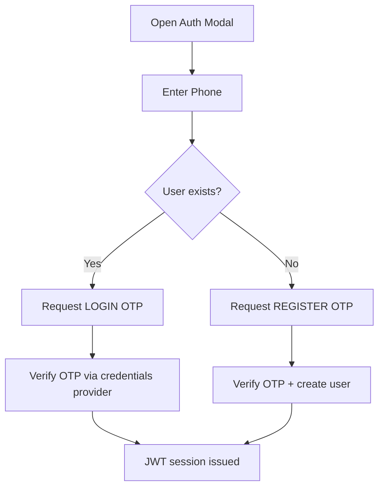
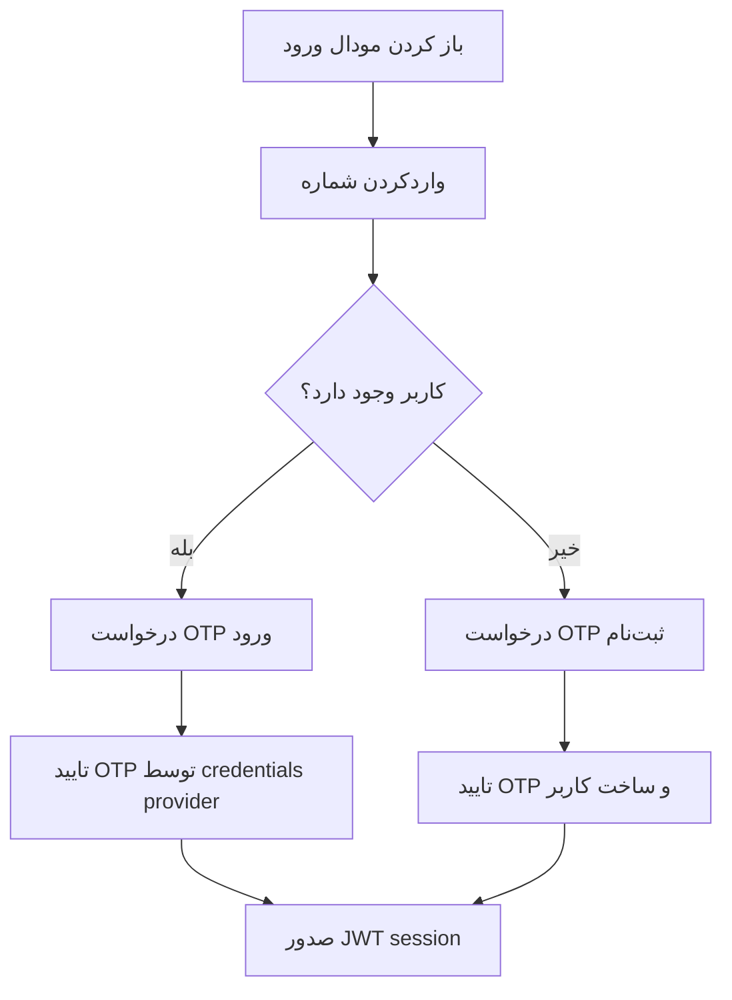

# 04. API, Authentication, Security

## English | فارسی

<details open>
<summary>English</summary>

## Beginner Mode

### API Inventory

| Endpoint                        | Method   | Purpose                                           | Auth                              |
| ------------------------------- | -------- | ------------------------------------------------- | --------------------------------- |
| `/api/auth/[...nextauth]`       | GET/POST | Auth.js handlers                                  | Public (internal auth flow)       |
| `/api/auth/otp`                 | POST     | Issue OTP code via SMS                            | Public (validated + rate-limited) |
| `/api/auth/check-phone`         | POST     | Phone existence check (enumeration-safe)          | Public                            |
| `/api/auth/register`            | POST     | Complete OTP-based registration                   | Public                            |
| `/api/auth/reset-password`      | POST     | Compatibility endpoint returning 410              | Public                            |
| `/api/account/checkout-profile` | GET      | Checkout profile bootstrap (user/address/allergy) | Auth required                     |
| `/api/admin/reports/export`     | GET      | CSV export for reports                            | Admin required                    |

### Request/Response Contracts (Examples)

#### `POST /api/auth/otp`

Request:

```json
{ "phone": "0912...", "purpose": "LOGIN" }
```

Success response:

```json
{ "ok": true, "cooldownMs": 60000 }
```

Rate-limited response:

```json
{ "error": "RATE_LIMITED", "retryAfterMs": 30000 }
```

#### `POST /api/auth/register`

Request:

```json
{
  "phone": "0912...",
  "code": "123456",
  "name": "Ali",
  "referredByCode": "ABC123"
}
```

Response:

```json
{ "ok": true }
```

### Validation & Middleware Notes

- Zod schemas under `lib/validation/auth.ts` validate auth payloads.
- Middleware enforces access by route class (public/protected/admin).
- Server actions still enforce user/role checks via `requireUser` and `requireAdmin`.

### Authentication Flow



### Authorization Model

- Route-level guard: `middleware.ts`
- Function-level guard: `lib/auth/session.ts`
- Admin policy: both middleware and action-level checks required

## Expert Mode

### API-to-Service Mapping

| API/Action Layer            | Service Layer                             | DB Touchpoints                         |
| --------------------------- | ----------------------------------------- | -------------------------------------- |
| `/api/auth/otp`             | `requestOtp` in `lib/server/otp.ts`       | `OtpCode`                              |
| `/api/auth/register`        | `verifyOtp`, `createUser`                 | `OtpCode`, `User`, `Referral`          |
| `/api/admin/reports/export` | `resolveRange`, `getSalesReport`, `toCSV` | `Order`, `OrderItem`                   |
| `placeOrderAction`          | `createOrder`, `incrementCustomOrders`    | `Order`, `OrderItem`, `CustomSandwich` |
| `dashboard/actions.ts`      | addresses/allergies repositories          | `Address`, `UserAllergy`               |
| `admin/actions.ts`          | categories/combos/discounts/customers     | admin domain tables                    |

### Security Controls Matrix

| Threat                    | Current Control                      | Gap                            | Recommendation                  |
| ------------------------- | ------------------------------------ | ------------------------------ | ------------------------------- |
| OTP brute force           | cooldown + max/hour + attempts + ttl | centralized telemetry missing  | add metrics and alerting        |
| Price tampering           | server-side recompute                | no end-to-end regression tests | add checkout contract tests     |
| Unauthorized admin access | middleware role check + requireAdmin | policy test gaps               | add role boundary tests         |
| User enumeration          | check-phone route response shaping   | timing side-channel unmeasured | normalize timing envelope       |
| Injection                 | Prisma parameterization + Zod        | raw SQL lint policy absent     | enforce code-scanning/lint rule |
| Secret leakage            | env-based secrets                    | rotation SOP not documented    | add runbook + periodic rotation |

### How To Add a New API Endpoint

1. Create `app/api/<domain>/<name>/route.ts`.
2. Validate payload with Zod schema in `lib/validation/<domain>.ts`.
3. Call or add domain logic in `lib/server/<domain>.ts`.
4. Enforce auth/role using `getCurrentUser` or `requireAdmin` pattern.
5. Return stable error codes (`VALIDATION`, `FORBIDDEN`, domain-specific constants).
6. Add docs to this file and test cases in future test suite.

### How To Deprecate/Delete Endpoint Safely

1. Mark endpoint as deprecated in docs and changelog.
2. Return warning headers for one release cycle.
3. Add temporary compatibility response (`410 Gone` when removed).
4. Remove callers and confirm no route references.

</details>

<details>
<summary>فارسی</summary>

## Beginner Mode

### فهرست APIها

| Endpoint                        | متد      | هدف                          | احراز                 |
| ------------------------------- | -------- | ---------------------------- | --------------------- |
| `/api/auth/[...nextauth]`       | GET/POST | هندلرهای Auth.js             | عمومی                 |
| `/api/auth/otp`                 | POST     | صدور OTP با SMS              | عمومی (با rate limit) |
| `/api/auth/check-phone`         | POST     | بررسی شماره بدون نشت اطلاعات | عمومی                 |
| `/api/auth/register`            | POST     | تکمیل ثبت‌نام OTP            | عمومی                 |
| `/api/auth/reset-password`      | POST     | Endpoint سازگاری با پاسخ 410 | عمومی                 |
| `/api/account/checkout-profile` | GET      | اطلاعات اولیه checkout       | نیاز به ورود          |
| `/api/admin/reports/export`     | GET      | خروجی CSV گزارش‌ها           | فقط ادمین             |

### نمونه قراردادها

#### `POST /api/auth/otp`

درخواست:

```json
{ "phone": "0912...", "purpose": "LOGIN" }
```

پاسخ موفق:

```json
{ "ok": true, "cooldownMs": 60000 }
```

پاسخ محدودسازی:

```json
{ "error": "RATE_LIMITED", "retryAfterMs": 30000 }
```

#### `POST /api/auth/register`

درخواست:

```json
{
  "phone": "0912...",
  "code": "123456",
  "name": "Ali",
  "referredByCode": "ABC123"
}
```

پاسخ:

```json
{ "ok": true }
```

### نکات Validation و Middleware

- اعتبارسنجی ورودی با Zod در `lib/validation/auth.ts`.
- کنترل دسترسی مسیرها در `middleware.ts`.
- کنترل نهایی نقش/کاربر در server actionها با `requireUser` و `requireAdmin`.

### جریان احراز هویت



### مدل مجوزدهی

- گارد مسیر: `middleware.ts`
- گارد تابعی: `lib/auth/session.ts`
- مسیرهای ادمین نیازمند کنترل دوگانه هستند

## Expert Mode

### نگاشت API به Service

| لایه API/Action             | لایه Service                              | نقاط دیتابیس                           |
| --------------------------- | ----------------------------------------- | -------------------------------------- |
| `/api/auth/otp`             | `requestOtp`                              | `OtpCode`                              |
| `/api/auth/register`        | `verifyOtp`, `createUser`                 | `OtpCode`, `User`, `Referral`          |
| `/api/admin/reports/export` | `resolveRange`, `getSalesReport`, `toCSV` | `Order`, `OrderItem`                   |
| `placeOrderAction`          | `createOrder`, `incrementCustomOrders`    | `Order`, `OrderItem`, `CustomSandwich` |
| `dashboard/actions.ts`      | سرویس آدرس/حساسیت                         | `Address`, `UserAllergy`               |
| `admin/actions.ts`          | سرویس تخفیف/دسته/کمبو/مشتری               | جدول‌های ادمین                         |

### ماتریس کنترل‌های امنیتی

| تهدید                    | کنترل فعلی                           | شکاف                          | پیشنهاد                   |
| ------------------------ | ------------------------------------ | ----------------------------- | ------------------------- |
| حمله brute-force روی OTP | cooldown + max/hour + attempts + ttl | نبود telemetry متمرکز         | افزودن متریک/alert        |
| دستکاری قیمت             | محاسبه قیمت در سرور                  | نبود تست رگرسیون end-to-end   | تست قرارداد checkout      |
| دسترسی غیرمجاز ادمین     | middleware + requireAdmin            | نبود policy test              | تست مرزبندی نقش           |
| User enumeration         | پاسخ کنترل‌شده check-phone           | اندازه‌گیری timing انجام نشده | همسان‌سازی زمان پاسخ      |
| Injection                | Prisma + Zod                         | policy lint برای raw SQL نیست | افزودن code scanning rule |
| نشت secrets              | env vars                             | SOP چرخش کلید مستند نیست      | تدوین runbook             |

### روش افزودن Endpoint جدید

1. ایجاد فایل route در `app/api/.../route.ts`.
2. تعریف schema در `lib/validation`.
3. پیاده‌سازی منطق دامنه در `lib/server`.
4. اعمال auth/role check.
5. بازگرداندن error codeهای پایدار.
6. ثبت مستندات و تست.

### روش حذف امن Endpoint

1. اعلام deprecation در مستندات.
2. یک چرخه release با هشدار.
3. بازگرداندن `410 Gone` در حذف نهایی.
4. حذف callerها و تأیید ارجاعات.

</details>
