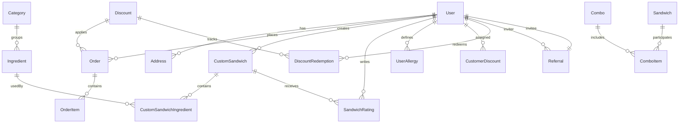

# 05. Database Architecture

## English | فارسی

English

## Beginner Mode

### Database Engine and ORM

- Engine: PostgreSQL
- ORM: Prisma (`prisma/schema.prisma`)
- Runtime access: singleton prisma client from `lib/db.ts`

### Entity Relationship Overview

### Core Tables

| Table                                          | What It Stores                                    |
| ---------------------------------------------- | ------------------------------------------------- |
| `User`                                         | identity, role, referral code, phone verification |
| `OtpCode`                                      | hashed OTP with expiry and attempt counters       |
| `Order` / `OrderItem`                          | checkout snapshot and line items                  |
| `CustomSandwich` / `CustomSandwichIngredient`  | user-created recipes and ingredients              |
| `SandwichRating`                               | ratings tied to purchaser order                   |
| `Discount` / `DiscountRedemption`              | discount policy and usage ledger                  |
| `Category` / `Ingredient` / `Sandwich` / `Tag` | product catalog                                   |
| `Referral`                                     | inviter/invitee conversion tracking               |
| `Address`                                      | user delivery addresses                           |
| `UserAllergy`                                  | allergy markers per user                          |

### Important Constraints

- Unique `User.phone`
- Unique `Discount.code`
- Unique `SandwichRating(userId, sandwichId)`
- Unique `CustomSandwichIngredient(sandwichId, ingredientId)`
- Unique `DiscountRedemption.orderId`

### Migrations and Seeders

- Migration directory: `prisma/migrations/*`
- Seed entrypoint: `prisma/seed.ts` (uses `lib/seed.ts`)
- Helpful commands:
  - `npm run db:migrate`
  - `npm run db:deploy`
  - `npm run db:seed`
  - `npm run db:studio`

## Expert Mode

### Transaction and Consistency Notes

- Rating write path recomputes aggregate rating fields in transaction semantics.
- Checkout writes order and line items atomically through repository layer.
- Discount usage integrity anchored by `DiscountRedemption` unique order mapping.

### Indexing Hot Paths

| Query Pattern              | Existing Index                                                          |
| -------------------------- | ----------------------------------------------------------------------- |
| user order history         | `Order(userId, createdAt)`                                              |
| order filtering by status  | `Order(status)`                                                         |
| public custom list sorting | `CustomSandwich(isPublic, averageRating)` and `(isPublic, totalOrders)` |
| OTP lookup and expiry      | `OtpCode(phone, purpose)`, `OtpCode(expiresAt)`                         |
| referral leaderboard       | `Referral(inviterId)`, `Referral(referralCode)`                         |

### Query Optimization Opportunities

- Add pagination and cursoring for admin reports at larger data volumes.
- Precompute dashboard aggregates in materialized views or scheduled summary tables.
- Introduce caching layer (Redis) for stable catalog reads.

### Backup Strategy (Recommended Operational Baseline)

1. Enable managed daily backups in DB provider.
2. Define restore drill frequency (monthly).
3. Store migration and seed version manifest with release artifacts.
4. Validate restore using staging smoke tests (auth + checkout + reports).

### Safe Schema Change Playbook

1. Add new nullable columns first.
2. Backfill data with script.
3. Switch read paths to new columns.
4. Enforce non-null/unique constraints in later migration.
5. Remove deprecated columns only after release stability window.

فارسی

## Beginner Mode

### موتور دیتابیس و ORM

- موتور: PostgreSQL
- ORM: Prisma (`prisma/schema.prisma`)
- دسترسی در زمان اجرا: prisma singleton در `lib/db.ts`

### نمای روابط اصلی

### جدول‌های کلیدی

| جدول                                           | کاربرد                           |
| ---------------------------------------------- | -------------------------------- |
| `User`                                         | هویت، نقش، کد معرفی، تایید شماره |
| `OtpCode`                                      | OTP هش‌شده با TTL و شمارنده تلاش |
| `Order` / `OrderItem`                          | snapshot سفارش و آیتم‌ها         |
| `CustomSandwich` / `CustomSandwichIngredient`  | دستورهای سفارشی کاربر            |
| `SandwichRating`                               | امتیازدهی وابسته به خرید         |
| `Discount` / `DiscountRedemption`              | سیاست تخفیف و ledger مصرف        |
| `Category` / `Ingredient` / `Sandwich` / `Tag` | کاتالوگ محصول                    |
| `Referral`                                     | ردیابی معرفی و تبدیل             |
| `Address`                                      | آدرس‌های کاربر                   |
| `UserAllergy`                                  | حساسیت‌های کاربر                 |

### قیود مهم

- یکتایی `User.phone`
- یکتایی `Discount.code`
- یکتایی `(userId, sandwichId)` در `SandwichRating`
- یکتایی `(sandwichId, ingredientId)` در `CustomSandwichIngredient`
- یکتایی `DiscountRedemption.orderId`

### مایگریشن و سید

- مسیر migration: `prisma/migrations/*`
- seed: `prisma/seed.ts` (با داده‌های `lib/seed.ts`)
- دستورات:
  - `npm run db:migrate`
  - `npm run db:deploy`
  - `npm run db:seed`
  - `npm run db:studio`

## Expert Mode

### نکات تراکنش و سازگاری

- مسیر امتیازدهی aggregateها را به‌روز می‌کند.
- checkout نوشتن order و line item را به شکل اتمیک انجام می‌دهد.
- یکپارچگی مصرف تخفیف با قید یکتای order در `DiscountRedemption` تضمین می‌شود.

### شاخص‌های پرترافیک

| الگوی کوئری         | ایندکس فعلی                                                           |
| ------------------- | --------------------------------------------------------------------- |
| تاریخچه سفارش کاربر | `Order(userId, createdAt)`                                            |
| فیلتر وضعیت سفارش   | `Order(status)`                                                       |
| مرتب‌سازی community | `CustomSandwich(isPublic, averageRating)` و `(isPublic, totalOrders)` |
| جستجوی OTP و انقضا  | `OtpCode(phone, purpose)` و `OtpCode(expiresAt)`                      |
| leaderboard معرفی   | `Referral(inviterId)` و `Referral(referralCode)`                      |

### فرصت‌های بهینه‌سازی

- pagination/cursor در گزارش‌های حجیم ادمین
- precompute برای dashboard aggregateها
- افزودن cache لایه‌ای (Redis) برای کاتالوگ

### راهبرد بکاپ پیشنهادی

1. فعال‌سازی بکاپ روزانه مدیریت‌شده.
2. تمرین بازیابی ماهانه.
3. نگهداری manifest نسخه migration/seed همراه release.
4. تست smoke روی staging بعد از restore.

### Playbook تغییر امن schema

1. ابتدا ستون nullable اضافه کنید.
2. بک‌فیل داده انجام دهید.
3. مسیر خواندن را مهاجرت دهید.
4. سپس قید non-null/unique را اعمال کنید.
5. حذف ستون deprecated فقط بعد از پنجره پایداری release.

